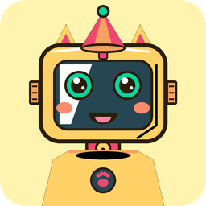
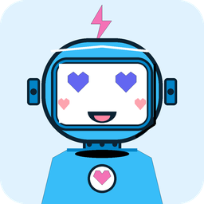
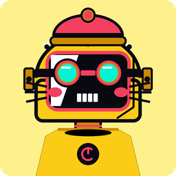
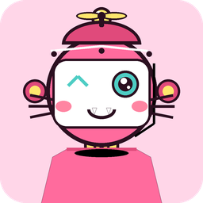
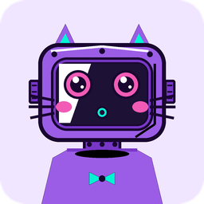
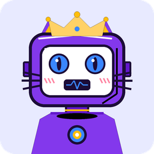
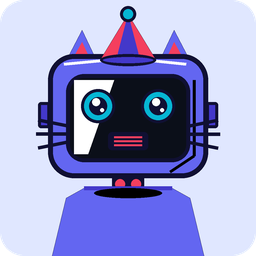
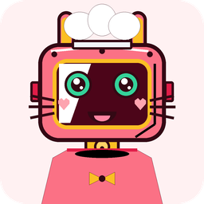
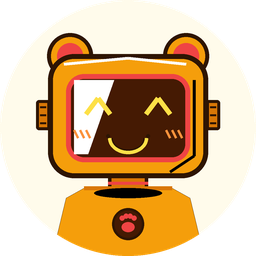
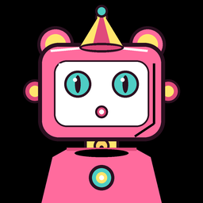

# 🤖 Bot-Face Examples & Gallery

A categorized visual gallery of avatars generated with `bot-face`, demonstrating **40 curated color palettes**, **mood/expression presets**, **animal presets**, **3D cel-shading & flat modes**, **retro visual filters**, and **transparent backgrounds**.

---

## 📑 Table of Contents

1. [🎭 Mood & Expression Presets](#1--mood--expression-presets)
2. [🐾 Animal Robot Presets (Cat, Bunny, Bear)](#2--animal-robot-presets-cat-bunny-bear)
3. [💡 Shading & Lighting Modes](#3--shading--lighting-modes)
4. [🔲 Transparent Backgrounds & Stickers](#4--transparent-backgrounds--stickers)
5. [🕹️ Retro & Pixel Art Filters](#5-️-retro--pixel-art-filters)
6. [🎨 Themed Characters & Color Palettes](#6--themed-characters--color-palettes)
   - [Candy & Pastel](#-candy--pastel)
   - [Cyberpunk & Cosmic](#-cyberpunk--cosmic)
   - [Warm & Botanical](#-warm--botanical)
7. [💻 Reproducible CLI & Python Recipes](#7--reproducible-cli--python-recipes)

---

## 1. 🎭 Mood & Expression Presets

Coordinate eyes, mouth expressions, and accessories to communicate explicit emotional states via `--mood <name>` or `mood="..."`.

| Preview | Mood Preset | Seed | Palette | Description |
|:---:|---|---|---|---|
|  | `happy` | `happy_bot` | `sunny_lemon` | Beaming happy smile with sparkling anime pupil eyes, party hat, and round rosy blush. |
|  | `love` | `love_bot` | `cotton_candy` | Glowing heart LED matrix eyes (`♥ ♥`), sweet heart blush cheeks, and heart chest badge. |
|  | `cool` | `cool_bot` | `cyberpunk_2077` | Sleek dark sunglasses, calm smile, and high-voltage neon yellow cyberpunk chassis. |
|  | `wink` | `wink_bot` | `bubblegum` | Playful wink eye with cheeky cat/vamp mouth, spinning propeller beanie, and rosy blush. |
|  | `surprised` | `surprised_bot` | `electric_berry` | Surprised open mouth (`:o`) with wide sparkling lens eyes and bowtie. |
|  | `sleepy` | `sleepy_bot` | `lavender_sky` | Sleepy LED dot eyes, oscilloscope snooze wave mouth, and dash blush. |
|  | `neutral` | `neutral_bot` | `tokyo_night` | Calm neutral robot with glossy pupil lens eyes, party hat, and speaker grill mouth. |

---

## 2. 🐾 Animal Robot Presets (Cat, Bunny, Bear)

Dedicated animal presets (`--cat`, `--bunny`, `--bear`, or `--animal <name>`).

| Preview | Animal | Seed | Palette | Description |
|:---:|---|---|---|---|
|  | `cat` (`--cat`) | `cat_bot_neko` | `bubblegum` | Pointed metallic cat ears, triple cheek whiskers, `:3` cat mouth, party hat, and bell collar. |
|  | `cat` (`--cat`) | `calico_bot` | `caramel_latte` | Circular caramel calico robot cat with glowing `^ ^` eyes, cute fangs, heart blush, and bell collar. |
|  | `bunny` (`--bunny`) | `bunny_sweetie` | `cherry_blossom` | Tall robotic bunny ears, triple whiskers, bowtie badge, and sweet smile. |
|  | `bear` (`--bear`) | `bear_champ` | `golden_hour` | Circular honey bear avatar with rounded metallic bear ears, pawprint badge, and happy grin. |
|  | `bunny` | `bunny_chef` | `cherry_blossom` | Tall bunny ears, tall pastry chef hat, and cute vamp fangs. |

---

## 3. 💡 Shading & Lighting Modes

Toggle between dimensional cel-shading with specular highlight cuts and glass sheens (`shading=True`, default) or clean flat minimalist vector illustration (`--no-shading` / `shading=False`).

| Preview | Seed | Shading Mode | Description |
|:---:|---|---|---|
|  | `vector_bot` | **3D Cel-Shaded** (`--shading`, default) | Dynamic top-left specular highlight curve, chassis shadow bevel, and diagonal glass faceplate reflection sheen. |
|  | `vector_bot` | **Minimalist Flat** (`--no-shading`) | Pure solid vector flat illustration with high-contrast outlines and no gradient or shadow cuts. |

---

## 4. 🔲 Transparent Backgrounds & Stickers

Pass `--transparent` or `transparent=True` to render the avatar with an alpha transparent canvas. Ideal for UI sticker components, Discord avatars, badges, and dark/light web embeds.

| Preview | Seed | Palette | Transparency | Description |
|:---:|---|---|---|---|
|  | `transparent_sticker` | `bubblegum` | `--transparent` | Fully transparent background sticker ready to place on any website background color. |

---

## 5. 🕹️ Retro & Pixel Art Filters

Transform any robot avatar into classic video game, CRT monitor, or blueprint aesthetics using `--filter <name>`.

| Preview | Filter | Seed | Palette | Description |
|:---:|---|---|---|---|
|  | `gameboy` | `gameboy_nostalgia` | `cyber_mint` | Authentic 4-color olive green Nintendo Game Boy DMG-01 LCD screen with dark outline boundary extraction. |
|  | `8bit` | `cyber_samurai` | `cyberpunk_2077` | Chunky retro 8-bit arcade / NES pixel art with 16-color quantization and sharp silhouette contours. |
|  | `16bit` | `arcade_champion` | `arcade_pop` | Smooth 16-bit SNES / Sega Genesis arcade pixel hero with Floyd-Steinberg error diffusion dithering. |
|  | `crt` | `neon_drifter` | `neon_coral` | Arcade CRT television monitor simulation featuring phosphor scanlines, bloom glow, and curved glass vignette. |
|  | `blueprint` | `blueprint_mech` | `tokyo_night` | Architectural cyan and navy technical blueprint schematic with inverted wireframe outlines. |
|  | `neon_glow` | `neon_cyber_bloom` | `poison_ivy` | High-saturation cyberpunk neon glow with bloom radiance and electric highlights. |
|  | `sepia` | `vintage_sepia` | `solar_flare` | Warm 19th-century daguerreotype photograph portrait tone. |
|  | `dither` | `dither_matrix` | `vaporwave` | 1-bit Floyd-Steinberg monochrome dot-matrix halftone printer / terminal dither. |

---

## 6. 🎨 Themed Characters & Color Palettes

### 🍬 Candy & Pastel

| Preview | Seed | Palette | Radius | Description |
|:---:|---|---|---|---|
|  | `alice@example.com` | `bubblegum` | 32px | Sweet pink bubblegum companion with sparkling kawaii anime eyes and blushing cheeks. |
|  | `strawberry_companion` | `strawberry_matcha` | 32px | Sweet strawberry red-pink chassis with matcha green accents and fresh leaf sprout. |
|  | `dragonfruit_sweetie` | `dragonfruit` | 36px | Neon fuchsia dragonfruit body with kiwi seed green ears and beaming smile. |
|  | `caramel_bot` | `caramel_latte` | 24px | Warm caramel and rich espresso tones with gentleman bowler hat and battery gauge. |

### 🌌 Cyberpunk & Cosmic

| Preview | Seed | Palette | Radius | Description |
|:---:|---|---|---|---|
|  | `cosmic_nebula_bot` | `galaxy_nebula` | 32px | Deep cosmic indigo and stellar purple galaxy robot with glowing starlight eyes. |
|  | `abyssal_diver` | `abyssal_deep` | Circle | Bioluminescent midnight navy and deep sea aqua diver with cyclops visor. |
|  | `electric_monarch` | `electric_berry` | 32px | Royal electric violet robot with glowing star eyes and golden jewel crown. |
|  | `angelic_bot` | `aurora_borealis` | 28px | Celestial polar aurora bot with floating glowing angel halo and arc reactor core. |

### 🌿 Warm & Botanical

| Preview | Seed | Palette | Radius | Description |
|:---:|---|---|---|---|
|  | `sunny_explorer` | `sunny_lemon` | Circle | Cheerful yellow circular profile avatar with spinning propeller beanie cap. |
|  | `tropic_explorer` | `tropic_paradise` | Circle | Caribbean ocean turquoise and mango yellow with hibiscus red chest badge. |
|  | `matcha_latte_bot` | `matcha_latte` | 32px | Calming matcha green robot with glowing heart LED eyes (`♥ ♥`) and sprout flower. |
|  | `emerald_guardian` | `emerald_bot` | 24px | Emerald green bot with gentleman bowler hat, mustache grill, and battery power meter. |
|  | `bumblebee_racer` | `bumblebee` | 20px | High-contrast bumblebee yellow racer robot with cyclops visor. |
|  | `sunset_rider` | `sunset_glow` | 16px | Radiant sunset orange robot with lightning bolt antenna, sunglasses, and shield badge. |
|  | `cosmic_party` | `lavender_sky` | 28px | Festive lavender robot with party cone hat, bowtie, and happy LED matrix (`^ ^`) eyes. |

---

## 7. 💻 Reproducible CLI & Python Recipes

### 1. In Love Robot with Heart Eyes
```bash
bf generate "love_bot" --mood love --palette cotton_candy --radius 32 --output love.png
```
```python
import bot_face

avatar = bot_face.generate(seed="love_bot", mood="love", palette="cotton_candy", corner_radius=32)
avatar.save("love.png")
```

### 2. Bunny Robot with Whiskers
```bash
bf generate "bunny_sweetie" --bunny --palette cherry_blossom --radius 32 --output bunny.png
```

### 3. Transparent UI Sticker
```bash
bf generate "sticker_bot" --transparent --palette bubblegum --output sticker.png
```

### 4. Complete Web Favicon & App Icon Suite
```bash
bf iconset "brand_avatar" --palette cyber_mint --circle --output-dir ./web_icons
```
```python
import bot_face

avatar = bot_face.generate(seed="brand_avatar", palette="cyber_mint", circle=True)
files = avatar.save_iconset("./web_icons")
print(f"Generated {len(files)} icon files!")
```

### 5. Flat Minimalist Avatar (No Shading)
```bash
bf generate "vector_bot" --no-shading --palette bubblegum --radius 32 --output flat.svg
```

### 6. Game Boy DMG-01 Retro LCD Screen
```bash
bf generate "gameboy_nostalgia" --palette cyber_mint --filter gameboy --output gameboy.png
```
