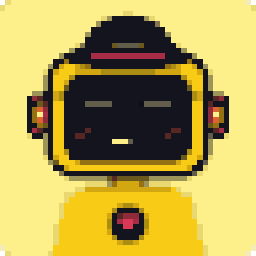
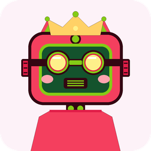
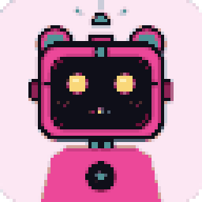
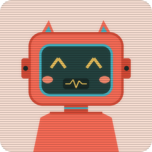
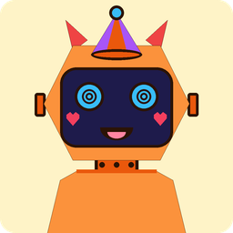
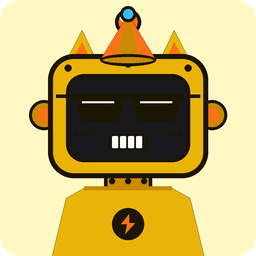
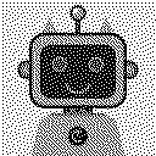
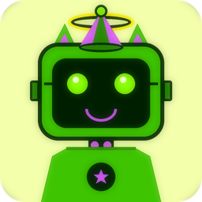

# 🤖 Bot-Face Examples & Gallery

A collection of example robot avatars generated with `bot-face`, demonstrating 40 curated bright color palettes, sharp high-contrast outlines that pop off any background, expressive robot anatomy, and retro visual filters.

---

## 🎨 Gallery

| Preview | Seed | Palette | Filter / Style | Description |
|---|---|---|---|---|
|  | `alice@example.com` | `bubblegum` | None (Radius: 32px) | Sweet Bubblegum robot with sparkling kawaii eyes, blushing cheeks, rounded corners, and crisp dark outlines. |
|  | `cyber_samurai` | `cyberpunk_2077` | `8bit` (Radius: 16px) | High-voltage electric neon yellow and magenta with chunky 8-bit retro pixel filter. |
|  | `cosmic_nebula_bot` | `galaxy_nebula` | None (Radius: 32px) | Cosmic deep indigo and stellar purple galaxy robot with glowing stars and crystal clear silhouettes. |
|  | `abyssal_diver` | `abyssal_deep` | Circle Clip | Bioluminescent deep sea navy and glowing aqua diver with cyclops visor. |
|  | `dragonfruit_sweetie` | `dragonfruit` | None (Radius: 36px) | Neon fuchsia dragonfruit pink with kiwi green accents, cat ears, and smiling face. |
|  | `tropic_explorer` | `tropic_paradise` | Circle Clip | Tropical Caribbean turquoise and mango yellow with hibiscus red badge. |
|  | `strawberry_companion` | `strawberry_matcha` | None (Radius: 32px) | Sweet strawberry red-pink and matcha green companion with leaf sprout. |
|  | `caramel_bot` | `caramel_latte` | None (Radius: 24px) | Warm caramel brown and espresso foam with gentleman bowler hat and battery gauge. |
|  | `gameboy_nostalgia` | `cyber_mint` | `gameboy` | Authentic 4-color olive green Nintendo Game Boy DMG-01 pixel LCD screen with dark outlines. |
|  | `arcade_champion` | `arcade_pop` | `16bit` (Radius: 24px) | 16-bit SNES/Genesis pixel art style with Floyd-Steinberg dither and cool shades. |
|  | `sunny_explorer` | `sunny_lemon` | Circle Clip | Cheerful yellow circular profile avatar with spinning propeller beanie cap. |
|  | `electric_monarch` | `electric_berry` | None (Radius: 32px) | Royal electric violet robot with glowing star eyes and golden jewel crown. |
|  | `neon_drifter` | `neon_coral` | `crt` (Radius: 20px) | Retro arcade CRT television monitor filter with scanlines and phosphor bloom. |
|  | `aqua_diver` | `aqua_splash` | Circle Clip | Deep ocean teal circular avatar with chunky headphone earmuffs and cat smile (`:3`). |
|  | `cosmic_party` | `lavender_sky` | None (Radius: 28px) | Festive lavender robot with party cone hat, bowtie, and happy LED matrix (`^ ^`) eyes. |
|  | `emerald_guardian` | `emerald_bot` | None (Radius: 24px) | Emerald green bot with gentleman bowler hat, mustache grill, and battery power meter. |
|  | `cotton_sweetie` | `cotton_candy` | None (Radius: 36px) | Pastel strawberry milk bot with robotic cat ears, rosy cheeks, and playful wink. |
|  | `sunset_glow` | `sunset_glow` | None (Radius: 16px) | Radiant sunset orange robot with lightning bolt antenna, sunglasses, and shield badge. |
|  | `matcha_latte_bot` | `matcha_latte` | None (Radius: 32px) | Calming matcha green robot with glowing heart LED eyes (`♥ ♥`) and sprout flower. |
|  | `angelic_bot` | `aurora_borealis` | None (Radius: 28px) | Celestial aurora bot with a floating glowing angel halo and arc reactor core. |
|  | `bunny_chef` | `cherry_blossom` | None (Radius: 32px) | Sakura pink robot with tall robotic bunny ears, chef hat, and cute vamp fangs. |
|  | `bumblebee_racer` | `bumblebee` | None (Radius: 20px) | High-contrast bumblebee yellow racer robot with cyclops visor. |
|  | `blueprint_mech` | `tokyo_night` | `blueprint` (Radius: 16px) | Architectural cyan & navy technical blueprint line art schematic. |
|  | `vintage_sepia` | `solar_flare` | `sepia` (Radius: 24px) | Warm nostalgic vintage sepia photograph robot portrait. |
|  | `dither_matrix` | `vaporwave` | `dither` | Floyd-Steinberg 1-bit dot matrix dithered newspaper/terminal style. |
|  | `neon_cyber_bloom` | `poison_ivy` | `neon_glow` (Radius: 32px) | Intense cyberpunk neon bloom with saturated toxic glow. |

---

## 💻 How to Reproduce Each Example

### 1. Classic Account Avatar (`alice@example.com`)
```bash
bf generate "alice@example.com" --palette bubblegum --radius 32 --output alice.png
```
```python
import bot_face

avatar = bot_face.generate(seed="alice@example.com", palette="bubblegum", corner_radius=32)
avatar.save("alice.png")
```

### 2. Cyberpunk Neon Yellow 8-Bit (`cyber_samurai`)
```bash
bf generate "cyber_samurai" --palette cyberpunk_2077 --filter 8bit --radius 16 --output samurai.png
```

### 3. Cosmic Galaxy Robot (`cosmic_nebula_bot`)
```bash
bf generate "cosmic_nebula_bot" --palette galaxy_nebula --radius 32 --output galaxy.png
```

### 4. Deep Sea Navy Diver (`abyssal_diver`)
```bash
bf generate "abyssal_diver" --palette abyssal_deep --circle --output diver.png
```

### 5. Dragonfruit Fuchsia (`dragonfruit_sweetie`)
```bash
bf generate "dragonfruit_sweetie" --palette dragonfruit --radius 36 --output dragonfruit.png
```

### 6. Game Boy DMG-01 Screen (`gameboy_nostalgia`)
```bash
bf generate "gameboy_nostalgia" --filter gameboy --output gameboy.png
```

### 7. Angelic Halo Robot (`angelic_bot`)
```bash
bf generate "angelic_bot" --palette aurora_borealis --radius 28 --output angel.png
```

### 8. Bunny Chef Robot (`bunny_chef`)
```bash
bf generate "bunny_chef" --palette cherry_blossom --radius 32 --output chef.png
```

### 9. CRT Television Screen (`neon_drifter`)
```bash
bf generate "neon_drifter" --palette neon_coral --filter crt --radius 20 --output crt.png
```

### 10. Blueprint Schematic (`blueprint_mech`)
```bash
bf generate "blueprint_mech" --filter blueprint --radius 16 --output blueprint.png
```
