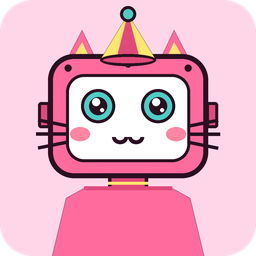
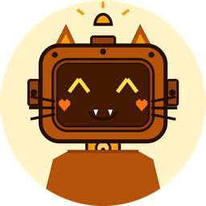

# 🤖 Bot-Face Examples & Gallery

A categorized visual gallery of avatars generated with `bot-face`, demonstrating **40 curated color palettes**, **3D cel-shading & flat modes**, **cute cat & animal features**, **retro visual filters**, and **custom corner clipping**.

---

## 📑 Table of Contents

1. [🐱 Cat & Animal Robot Avatars](#1--cat--animal-robot-avatars)
2. [💡 Shading & Lighting Modes](#2--shading--lighting-modes)
3. [🕹️ Retro & Pixel Art Filters](#3-️-retro--pixel-art-filters)
4. [🎨 Themed Characters & Color Palettes](#4--themed-characters--color-palettes)
   - [Candy & Pastel](#-candy--pastel)
   - [Cyberpunk & Cosmic](#-cyberpunk--cosmic)
   - [Warm & Botanical](#-warm--botanical)
5. [🔲 Corner Radius & Profile Clipping](#5--corner-radius--profile-clipping)
6. [💻 Reproducible CLI & Python Recipes](#6--reproducible-cli--python-recipes)

---

## 1. 🐱 Cat & Animal Robot Avatars

Robots with feline features, whiskers, bell collars, animal ears, and cute expressions. Forced using `--cat` or `cat=True`.

| Preview | Seed | Palette | Style Options | Highlights |
|:---:|---|---|---|---|
|  | `cat_bot_neko` | `bubblegum` | `--cat` (Radius: 32px) | Triple cheek whiskers, cute `:3` cat mouth, festive party hat, and golden bell collar. |
|  | `calico_bot` | `caramel_latte` | `--cat` (Circle Clip) | Calico caramel robot cat with glowing `^ ^` eyes, cute vamp fangs, heart blush, and bell collar. |
|  | `cyber_cat_9000` | `cyberpunk_2077` | `--cat` (`8bit`, Radius: 16px) | High-voltage neon yellow cyberpunk cat with whiskers, royal crown, and 8-bit retro filter. |
|  | `cotton_sweetie` | `cotton_candy` | Radius: 36px | Robotic cat ears, rosy blushing cheeks, playful wink expression, and pastel strawberry milk palette. |
|  | `bunny_chef` | `cherry_blossom` | Radius: 32px | Tall robotic bunny ears, tall pastry chef hat, and cute vamp fangs. |

---

## 2. 💡 Shading & Lighting Modes

Toggle between dimensional cel-shading with specular highlight cuts and glass sheens (`shading=True`, default) or clean flat minimalist vector illustration (`--no-shading` / `shading=False`).

| Preview | Seed | Shading Mode | Description |
|:---:|---|---|---|
|  | `vector_bot` | **3D Cel-Shaded** (`--shading`, default) | Dynamic top-left specular highlight curve, chassis shadow bevel, and diagonal glass faceplate reflection sheen. |
|  | `vector_bot` | **Minimalist Flat** (`--no-shading`) | Pure solid vector flat illustration with high-contrast outlines and no gradient or shadow cuts. |

---

## 3. 🕹️ Retro & Pixel Art Filters

Transform any robot avatar into classic video game, CRT monitor, or blueprint aesthetics using `--filter <name>`.

| Preview | Filter | Seed | Palette | Description |
|:---:|---|---|---|---|
|  | `gameboy` | `gameboy_nostalgia` | `cyber_mint` | Authentic 4-color olive green Nintendo Game Boy DMG-01 LCD screen with dark outline boundary extraction. |
|  | `8bit` | `cyber_samurai` | `cyberpunk_2077` | Chunky retro 8-bit arcade / NES pixel art with 16-color quantization and sharp silhouette contours. |
|  | `16bit` | `arcade_champion` | `arcade_pop` | Smooth 16-bit SNES / Sega Genesis arcade pixel hero with Floyd-Steinberg error diffusion dithering. |
|  | `crt` | `neon_drifter` | `neon_coral` | Arcade CRT television monitor simulation featuring phosphor scanlines, bloom glow, and curved glass vignette. |
|  | `blueprint` | `blueprint_mech` | `tokyo_night` | Architectural cyan and navy technical blueprint schematic with inverted wireframe outlines. |
|  | `neon_glow` | `neon_cyber_bloom` | `poison_ivy` | High-saturation cyberpunk neon glow with bloom radiance and electric highlights. |
|  | `sepia` | `vintage_sepia` | `solar_flare` | Warm 19th-century daguerreotype photograph portrait tone. |
|  | `dither` | `dither_matrix` | `vaporwave` | 1-bit Floyd-Steinberg monochrome dot-matrix halftone printer / terminal dither. |

---

## 4. 🎨 Themed Characters & Color Palettes

### 🍬 Candy & Pastel

| Preview | Seed | Palette | Radius | Description |
|:---:|---|---|---|---|
|  | `alice@example.com` | `bubblegum` | 32px | Sweet pink bubblegum companion with sparkling kawaii anime eyes and blushing cheeks. |
|  | `strawberry_companion` | `strawberry_matcha` | 32px | Sweet strawberry red-pink chassis with matcha green accents and fresh leaf sprout. |
|  | `dragonfruit_sweetie` | `dragonfruit` | 36px | Neon fuchsia dragonfruit body with kiwi seed green ears and beaming smile. |
|  | `caramel_bot` | `caramel_latte` | 24px | Warm caramel and rich espresso tones with gentleman bowler hat and battery gauge. |

### 🌌 Cyberpunk & Cosmic

| Preview | Seed | Palette | Radius | Description |
|:---:|---|---|---|---|
|  | `cosmic_nebula_bot` | `galaxy_nebula` | 32px | Deep cosmic indigo and stellar purple galaxy robot with glowing starlight eyes. |
|  | `abyssal_diver` | `abyssal_deep` | Circle | Bioluminescent midnight navy and deep sea aqua diver with cyclops visor. |
|  | `electric_monarch` | `electric_berry` | 32px | Royal electric violet robot with glowing star eyes and golden jewel crown. |
|  | `angelic_bot` | `aurora_borealis` | 28px | Celestial polar aurora bot with floating glowing angel halo and arc reactor core. |

### 🌿 Warm & Botanical

| Preview | Seed | Palette | Radius | Description |
|:---:|---|---|---|---|
|  | `sunny_explorer` | `sunny_lemon` | Circle | Cheerful yellow circular profile avatar with spinning propeller beanie cap. |
|  | `tropic_explorer` | `tropic_paradise` | Circle | Caribbean ocean turquoise and mango yellow with hibiscus red chest badge. |
|  | `matcha_latte_bot` | `matcha_latte` | 32px | Calming matcha green robot with glowing heart LED eyes (`♥ ♥`) and sprout flower. |
|  | `emerald_guardian` | `emerald_bot` | 24px | Emerald green bot with gentleman bowler hat, mustache grill, and battery power meter. |
|  | `bumblebee_racer` | `bumblebee` | 20px | High-contrast bumblebee yellow racer robot with cyclops visor. |
|  | `sunset_rider` | `sunset_glow` | 16px | Radiant sunset orange robot with lightning bolt antenna, sunglasses, and shield badge. |
|  | `cosmic_party` | `lavender_sky` | 28px | Festive lavender robot with party cone hat, bowtie, and happy LED matrix (`^ ^`) eyes. |

---

## 5. 🔲 Corner Radius & Profile Clipping

| Shape | CLI Argument | Python Parameter | Visual Outcome |
|---|---|---|---|
| **Sharp Square** | `--radius 0` (default) | `corner_radius=0` | Classic square container for standard thumbnails |
| **Rounded Rectangle** | `--radius 16` to `--radius 48` | `corner_radius=32` | Smooth modern app icon styling |
| **Circular Clip** | `--circle` / `-c` | `circle=True` | Perfect round avatar ideal for modern social profile pictures |

---

## 6. 💻 Reproducible CLI & Python Recipes

### 1. Cute Cat Robot Neko
```bash
bf generate "cat_bot_neko" --cat --palette bubblegum --radius 32 --output neko.png
```
```python
import bot_face

avatar = bot_face.generate(seed="cat_bot_neko", cat=True, palette="bubblegum", corner_radius=32)
avatar.save("neko.png")
avatar.save("neko.svg")
```

### 2. Flat Minimalist Avatar (No Shading)
```bash
bf generate "vector_bot" --no-shading --palette bubblegum --radius 32 --output flat.svg
```
```python
import bot_face

avatar = bot_face.generate(seed="vector_bot", shading=False, palette="bubblegum", corner_radius=32)
avatar.save("flat.svg")
```

### 3. Game Boy DMG-01 Retro LCD Screen
```bash
bf generate "gameboy_nostalgia" --palette cyber_mint --filter gameboy --output gameboy.png
```
```python
import bot_face

avatar = bot_face.generate(seed="gameboy_nostalgia", palette="cyber_mint", filter="gameboy")
avatar.save("gameboy.png")
```

### 4. 8-Bit Cyberpunk Pixel Art
```bash
bf generate "cyber_samurai" --palette cyberpunk_2077 --filter 8bit --radius 16 --output samurai.png
```

### 5. Circular Profile Avatar
```bash
bf generate "user_profile" --palette sunny_lemon --circle --output profile.png
```
```python
import bot_face

avatar = bot_face.generate(seed="user_profile", palette="sunny_lemon", circle=True)
avatar.save("profile.png")
```

### 6. Batch Generation of Multiple Users
```bash
bf batch alice bob charlie dev_team admin --radius 24 --format png --output-dir ./avatars
```
